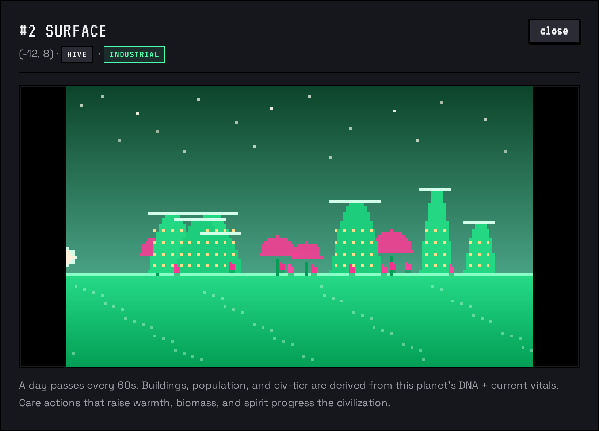
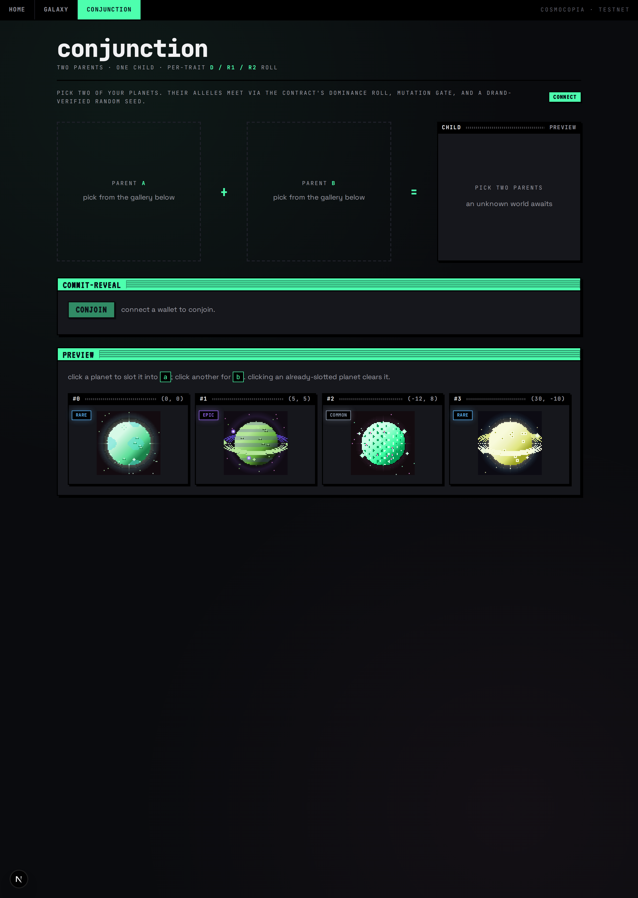

# Cosmocopia

> Tiny pixel-art worlds, on-chain on Stellar. Conjoin two planets — get a new one. Care for them or they wither. Hunt for Mystic-tier traits across a 5-tier rarity ladder, and watch dominant + recessive alleles flow through your lineage.


*Live read from the testnet contract. The "preview" panel shows four planets minted via the **commit-reveal flow**; per-card vitals + tier badges + animated rarity overlays come from the chain. The tinker panel renders any 32-byte DNA you paste. Brutalist UI tokens (solid-green title bars, hard offset shadows, JetBrains Mono / VT323 chrome) ported from the in-repo [Cosmocopia Web UI Kit](web/Cosmocopia%20Web%20UI%20Kit.html).*

Cosmocopia is an Axie-style collection-of-creatures project, but instead of monsters they are **planets**: each a 64×64 pixel art world programmatically rendered from on-chain DNA, born from drand-verified randomness on Stellar/Soroban. Each planet also has a side-view "surface" you can visit, with civ-tier buildings and animated inhabitants generated from the same DNA + current care state.

The deliberate non-goal: no game / no PvP / no economy beyond mint + conjoin + care. The fun lives in the genetics, the art, the rarity hunt, and the galaxy map.

## The big ideas

### Planets
A planet is a Soroban NFT with three pieces of state:

- **DNA** — 32 immutable bytes, set at mint, drives every visual trait (the *dominant* / D allele per trait slot).
- **Latent** — 32 immutable bytes carrying the **R1 + R2 recessive alleles** for each trait. Set at mint from the same drand seed; flows through breeding.
- **Vitals** — 5 mutable stats that decay over ledger time and respond to interactions.

### Conjunction (the breeding mechanic, renamed)
The astronomical term for "two bodies meeting in the sky" is a **conjunction**. We use it as our verb:

> *Conjoin* two planets, and at the next drand round a third planet is **conceived**.

Two parents → child with per-trait dominance roll. For each of the 8 trait slots:
- Each parent samples one allele from its own (D, R1, R2) pool — weights **70 / 22 / 8**.
- The two contributions meet: one randomly becomes the child's expressed D, the other becomes its R1.
- The child's R2 comes from a "sticky" pool weighted toward the parents' own R2 alleles, so famous lineages stay traceable across ~3 generations (game-audit F9).
- A ~3% mutation chance XORs a random byte into the child's D per trait.

When a child expresses a recessive that wasn't visible in either parent, the contract emits a **`RecessiveEmerged`** event so off-chain indexers can show "your Hollow planet's eyes finally re-emerged!" UX.

### Rarity tiers

Five tiers derived from existing DNA + galaxy coords (pure-frontend, no extra storage):

| Tier | Distribution | Animation overlay |
| --- | --- | --- |
| **Common** | ~50 % | none (static) |
| **Rare** | ~33 % | breathing aura pulse |
| **Epic** | ~14 % | orbital sparkles |
| **Legendary** | ~3 % | rotating halo ring |
| **Mystic** | <1 % | corona arcs + particle ring |

Sources contributing to the rarity score: class mythics (Aether, Hollow) and exotics; rare atmospheres / features / auras; intensity bonuses; ring + moon counts; stored rarity nibble; G0 scarcity bonus; combo bonuses (e.g. Aether × aurora-aura, Hollow × eyes); galaxy-coord scarcity for inner-core lattice points. Full breakdown in `art/src/rarity.ts`.

### Care
Planets are not idle. Each has five vitals (0–255):

| Vital | Decays from | Restored by |
| --- | --- | --- |
| Temperature | Cold sectors, ice/void classes | `warm` (sun ritual) |
| Hydration | Lava class, desert sectors | `rain` (cloud seeding) |
| Gravity | Long quiet stretches | `tide` (gravity pulse) |
| Biomass | Inactivity, void class | `tend` (gardening) |
| Spirit | Isolation in the galaxy | `reflect`, nearby neighbors |

Stats outside `[40, 220]` reduce conjunction success and add a "sickly" aura overlay. Care recipe differs by class — watering a Lava planet hurts it.

### Planet view — visit the surface



Every planet card has a **`visit surface →`** button that opens a side-view scene rendered procedurally from the planet's DNA + current vitals. The example above is planet **#2** (HIVE population × INDUSTRIAL civ tier) at night: green Hive mound architecture with lit windows, pink kelp between the mounds, starfield up top, a sun setting off the left edge, and tiny inhabitants bobbing along the horizon. The full composition pipeline:

- **Sky** — gradient atmosphere-tinted (storm / aurora / sparkle / eclipse / toxic all alter the upper band)
- **Celestials** — sun arc + dynamic starfield driven by a 60-second day cycle
- **Terrain** — base band with pattern-driven scatter flecks
- **Foliage** — trees / kelp / crystals (kind picked by population)
- **Buildings** — style varies by population (Humanoid / Aquatic / Avian / Crystalline / Subterranean / Hive — 6 types) and civ tier (Primitive → Agricultural → Industrial → Information → Spacefaring — 5 stages). Height + count grow with civ tier.
- **Inhabitants** — 2×2 silhouettes that walk / fly / swim / burrow depending on population, with footstep bobs and wing-flap animations.

Both **population** and **civ_tier** are now on-chain. Population is a D/R1/R2 allele triple in the latent blob (bytes 16/17/18); the public `latent[16] % 6` gives the visible population type 0..5. civ_tier is a per-planet `u8` stored under `DataKey::CivTier(id)`, ratchets up on `care` once `stats::civ_signal(vitals, class)` crosses a 51-point threshold (class-aware — Crystal/Hollow/Void all have inverted-thriving profiles so they can reach Spacefaring too). New views: `population_of(id)`, `civ_tier_of(id)`. New events: `PopulationExpressed`, `CivTierChanged`. The frontend `scene.ts` derivations still apply for legacy planets and as a local cache; cutover to live contract reads is a follow-up PR.

### Galaxy


*The `/galaxy` page is a **full-bleed stage** — the canvas fills the viewport edge-to-edge. Two floating panels overlay it: **SECTORS** legend top-right (always visible, with the kit's solid-green title bar), and a **PLANET #N** detail panel bottom-right that appears when you click any planet — coords, sector, the five vitals, owner address, and the full DNA hex. A tiny uppercase hint chip in the bottom-left reports the planet count + controls. Concentric dashed rings mark the five sectors; the same `r²` thresholds drive [`stats::project`](contracts/planet/src/stats.rs) so a planet's location actually shapes its decay. Pan with drag, zoom with the wheel.*

Each planet has `(x, y)` coordinates in an integer grid. The grid is partitioned into five **sectors** that each apply stat drift modifiers (boundaries are `r²` thresholds — integer math, no sqrt — see [`galaxy::sector_of`](contracts/planet/src/galaxy.rs)):

| Sector | `r <` | Drift on (temp, hydro, gravity, biomass, spirit) per period |
| --- | --- | --- |
| *Inner Core* | 5 | (+1, −1, +2, 0, 0) — high gravity, slow decay |
| *Habitable Belt* | 15 | (0, 0, 0, +1, +1) — neutral, social bonus |
| *Asteroid Field* | 30 | (0, −1, +1, −2, 0) — biomass↓ |
| *Frontier* | 50 | (−1, 0, 0, −1, +2) — spirit↑ from isolation |
| *Outer Dark* | ∞ | (−2, −1, −1, −1, −1) — harsh, exotic |

Distance between two parents sets the **conjunction cost** (not yet implemented — see roadmap) and, indirectly, the mutation rate. Two neighbours yield cheap, conservative children; opposites yield expensive, exotic ones.

### Conjunction page



*The `/conjunction` page is a dedicated 5-column compose: **parent A + parent B = child**. Empty parent slots are dashed-border drop targets; the child slot previews the midpoint coordinate and reminds you that the art is sealed until reveal. Below the grid, a COMMIT-REVEAL panel houses the big primary CONJOIN button and surfaces the live phase (`committing → waiting (N ledgers) → revealing → done`). The candidate gallery at the bottom is click-to-slot — pick two and the button enables.*

## DNA layout (32 visible + 32 latent bytes)

```
Visible DNA (BytesN<32>, returned by dna_of):
  0   class_gene    high nibble = class (16 classes) | low nibble = dominance map
  1   surface_gene  high = pattern (striped/spotted/swirled/cracked/smooth/...) | low = rings (0-7)
  2   atmosphere_gene  none/thin/thick/storm/aurora/toxic/sparkle/eclipse + density
  3   feature_gene  craters/oceans/mountains/forests/cities/eyes/volcanoes/runes/blossoms + intensity
  4   moon_gene     count (0-4) + style + tilt
  5   aura_gene     none/halo/glow/shadow/pulse/aurora-aura/static/crown + intensity
  6   palette_hue   base hue (0-255 ≈ 0-360°)
  7   palette_meta  scheme (mono/analogous/complementary/triadic/split) + sat + lum
  8-11   parent_mix   parent DNA XOR-mixed (lineage signature)
  12-15  birth_round drand round at mint (u32 BE) — also reproducible seed
  16     generation   0 for genesis, parent_max + 1 otherwise
  17     affinity_rarity  affinity (solar/lunar/void/storm) | rarity bits
  18-31  reserved    14 bytes of headroom for future traits & uniqueness salt

Latent (BytesN<32>, returned by latent_of):
  0-7    R1 alleles  for trait slots 0..7 (recessive #1 per trait)
  8-15   R2 alleles  for trait slots 0..7 (recessive #2 per trait)
  16-31  reserved    population gene + civ_tier recessives (roadmap)
```

Visible bytes are the expressed **D allele**. The latent blob is invisible to the rendered art but flows through `crossover_with_latent` on every conjoin. Legacy planets (minted before the dominance system shipped) carry no Latent storage; the contract synthesizes a "D-only" latent for them at breeding time so they keep working without diluting offspring with zero bytes.

16 classes: `Rocky, Gas, Ocean, Lava, Ice, Desert, Jungle, Crystal, Void, Forge, Bloom, Cinder, Mist, Quartz, Hollow, Aether`.

## Architecture

```
cosmocopia/
├── contracts/                  # Soroban Rust workspace
│   ├── Cargo.toml              # workspace + pinned OpenZeppelin stellar-* crates
│   └── planet/
│       └── src/
│           ├── lib.rs          # NonFungibleToken + entrypoints + commit-reveal + Latent storage
│           ├── dna.rs          # DNA encoding, latent_from_seed, crossover_with_latent (D/R1/R2)
│           ├── stats.rs        # vitals + decay + care
│           ├── galaxy.rs       # coords + sector lookup + distance
│           └── drand.rs        # cross-contract client for Drand-Relay verifier
├── art/                        # Deterministic pixel-art renderer (pure TS)
│   └── src/
│       ├── dna.ts              # 32-byte parser matching contract layout
│       ├── palette.ts          # HSL palette schemes
│       ├── rarity.ts           # Common→Mystic tier scorer + contribution log
│       ├── scene.ts            # side-view surface composer (population × civ tier)
│       ├── render.ts           # planet sprite compose (core, surface, atmosphere, rings, features, moons, aura)
│       └── rng.ts              # mulberry32 seeded by DNA
├── web/                        # Next.js 15 App Router dApp
│   ├── Cosmocopia Web UI Kit.html  # canonical design reference (rendered to globals.css)
│   ├── app/
│   │   ├── layout.tsx          # mounts <TopNav/> + fonts preconnect
│   │   ├── page.tsx            # /        home — hero HUD, tinker, traits, gallery
│   │   ├── galaxy/page.tsx     # /galaxy  full-bleed stage + floating panels
│   │   ├── conjunction/page.tsx # /conjunction — parent A + parent B = child compose
│   │   └── globals.css         # design system tokens + UI kit primitives
│   ├── components/
│   │   ├── TopNav.tsx          # sticky .kit-tabs (HOME/GALAXY/CONJUNCTION) with active-route highlight
│   │   ├── OwnedPlanets.tsx    # owned-planet gallery + inline conjoin picker (home)
│   │   ├── PlanetSprite.tsx    # canvas planet + tier animation overlay
│   │   ├── PlanetView.tsx      # surface modal — animated side-scene
│   │   ├── RarityBadge.tsx     # tier pill + tooltip with score breakdown
│   │   ├── GalaxyMap.tsx       # 2D map at /galaxy (uses .galaxy-stage + .floating-panel)
│   │   ├── Traits.tsx          # DNA trait readout
│   │   └── ConnectButton.tsx   # passkey + Wallets Kit chooser, renders .chip when connected
│   └── lib/
│       ├── cosmocopia.ts       # high-level read/write + commit-reveal orchestration
│       ├── wallet-context.tsx  # dual-wallet state (passkey + classic)
│       └── planet-bindings/    # auto-generated TS bindings from the deployed contract
├── scripts/
│   ├── deploy-testnet.sh       # build + deploy contract to testnet + seed 4 genesis via commit-reveal
│   └── transfer-planet.sh      # admin transfer to hand a seeded planet to a smart account
└── README.md
```

## External dependencies

- **Drand-Relay** ([kaankacar/Drand-Relay](https://github.com/kaankacar/Drand-Relay)) — testnet verifier `CAESC7SC5EW5P2P3IM5Q7E64ZNDATVSN5F57NTCH5E7GJRPDM76KF7QM`. Used as the source of fair, externally-verifiable randomness for every mint and conjunction.
- **OpenZeppelin stellar-contracts** ([repo](https://github.com/OpenZeppelin/stellar-contracts)) — `stellar-tokens::non_fungible` for the NFT base + `enumerable` extension for the supply iteration, `stellar-access::ownable` for admin gating.
- **OpenZeppelin Contracts Wizard** — used to seed the initial NFT shell (Stellar tab on wizard.openzeppelin.com or the `@openzeppelin/wizard-stellar` npm package).
- **Smart Account Kit** ([kalepail/smart-account-kit](https://github.com/kalepail/smart-account-kit), published on npm as `smart-account-kit`) — passkey-based smart wallets. Testnet WASM hash `8537b8166c0078440a5324c12f6db48d6340d157c306a54c5ea81405abcc2611`, WebAuthn verifier `CCMR63YE5T7MPWREF3PC5XNTTGXFSB4GYUGUIT5POHP2UGCS65TBIUUU`.
- **Stellar Wallets Kit** ([Creit-Tech/Stellar-Wallets-Kit](https://github.com/Creit-Tech/Stellar-Wallets-Kit), JSR package `@creit-tech/stellar-wallets-kit`) — modal adapter for Freighter, xBull, Albedo, Lobstr, Rabet, Hana, etc.

## Mint flow: commit-reveal

Every mint and conjunction is a **two-step commit-reveal** so the caller cannot peek the random seed before submitting. This closes the audit's two original Critical findings (DNA grinding via simulate-and-pick).

1. **Commit** — caller supplies `observed_round` (the latest drand round they can see). Contract stores `target_round = observed_round + 10` and stamps `commit_ledger = now`. Emits a `Committed` event with the commitment id.
2. **Wait** — `MIN_REVEAL_DELAY_LEDGERS = 8` ledgers (~40 s, ~13 drand rounds).
3. **Reveal** — anyone can call `reveal_genesis(id)` / `reveal_conjoin(id)`. Contract verifies the delay elapsed, fetches `drand.get(target_round)`, derives both the visible DNA *and the latent allele blob* from the same seed, mints, deletes the commitment.

Because the reveal delay (13 drand rounds) is strictly larger than the lookahead (10 rounds), the target round's randomness is provably published *after* the commit landed — there is no round whose seed the user could have inspected at commit time to pick a favorable child. Lying about `observed_round` doesn't help: the reveal-time ledger gap is independent of the caller's claim.

`submitConjoin` on the frontend orchestrates this in one call:

```
committing → waiting (polls reveal_after) → revealing → done
```

Pass an `onProgress` callback to surface phase to the UI; `submitCommitConjoin` and `submitRevealConjoin` are also exported as separate halves if you need to defer the reveal.

## Audit cycle

Three audits were run as background agents on a `dominance`-tip worktree:

- **Smart contract audit** — 0 Critical, 0 High, **4 Medium** (sibling latent stir, mutation rate doc mismatch, legacy-parent zero injection, allele-weight doc), 5 Low, 8 Informational. Cleared for mainnet pending Medium fixes. All four Mediums + the `RecessiveEmerged` event (I5) + the legacy-mock-auth fn name (L4) closed in commit `1cfb563`.
- **Game design audit** — 2 Critical (inner-core coord squatting, invisible recessives in the UI), 4 High (G0 bonus regression in rarity score, rarity nibble drift, recessive half-life too short, parallel grinding via per-planet cooldown, class-blind civ tier), 5 Medium, 3 Low, 5 Informational. Two Highs closed in this cycle: **F9** (sticky R2 inheritance via `{a.R2, a.R2, b.R2, b.R2}` pool — half-life now ~3 gens) and **F2** (ring/moon weight on absolute count, not threshold). Remaining items tracked in the roadmap.
- **Design-system audit** — 1 mostly-compliant codebase; non-compliance concentrated in `GalaxyMap.tsx`. Closed H1–H4 + 6 Mediums in commit `4fd824f`.

Full reports kept under `/home/raph/.claude/jobs/12194f7c/{contract,game,design}-audit.md` while in flight; will be moved into `docs/audits/` if they outlive this development cycle.

## Sign-in

The frontend offers both paths side-by-side. Users pick at connect time:

- **Continue with a passkey** — Smart Account Kit deploys a smart-account contract on testnet, gas-sponsored, signed via WebAuthn. No extension needed; works on iOS/macOS/Android/Windows Hello. Returns a `C...` contract address as the signing identity.
- **Connect an existing wallet** — Stellar Wallets Kit's auth modal lists installed wallets. Returns a `G...` public key as the signing identity.

Either identity is passed to the planet contract as the `to:` / owner address. Configure via `web/.env.local`.

### Trying the passkey flow end-to-end

For a passkey-owned smart account to actually *do* anything on chain, it needs to own a planet first (the contract's `care` / `conjoin` calls require the planet's owner to authorize). The seeded planets all start owned by the deployer. To hand one over:

```bash
# 1. Connect with a passkey at http://localhost:3030 → note the C... contract address
# 2. Transfer one of the genesis planets to that address:
bash scripts/transfer-planet.sh 1 CXXXXXXX...
# 3. Refresh the page → your gallery now includes that planet → click a care button.
```

The care button triggers a WebAuthn prompt; on confirmation, Smart Account Kit signs the auth entry, re-simulates, and submits.

## UI design system

The visual language is captured in [`web/Cosmocopia Web UI Kit.html`](web/Cosmocopia%20Web%20UI%20Kit.html) — a self-extracting reference page that bundles the kit's CSS + DOM snapshot. The live app ports it via `web/app/globals.css`. Highlights:

- **Brutalist slabs** — flat near-black panels (`--nebula #16171c`), pure-black 2 px borders, hard offset shadows (`4px 4px 0 var(--pitch)`), zero soft drops.
- **Habitable-belt green** primary (`--primary #4dffae`) used only for splashes — title bars, primary buttons, focus rings, code accents, telemetry dots.
- **Solid-green title bars** with dark uppercase text and a hatched stripe filler (`.panel-titlebar` → `.tb-title` + `.tb-stripes`). Per-card title bars are pitch-black with a stardust stripe.
- **Top tab nav** (`.kit-tabs`) — sticky, with `[data-active="true"]` tabs as solid green blocks.
- **Hero HUD** — planet glyph with rotating dashed orbit ring, big mono wordmark, three telemetry stat tiles, identity strip with wallet chip + connect button.
- **Typography triple** — Space Grotesk (body), JetBrains Mono (display + chrome), VT323 (pixel chrome for stat values).
- **One ambient animation** — wallet chip pulses auroral green; otherwise the UI is static unless a planet is at Rare or above.

## Live deployment

Contract: [`CBIWWHZH67EATB5P4OEXDKWSY6NRGE6MTQGWIXJVYJKQKMSL265FSPWV`](https://stellar.expert/explorer/testnet/contract/CBIWWHZH67EATB5P4OEXDKWSY6NRGE6MTQGWIXJVYJKQKMSL265FSPWV) on Stellar testnet. Carries the D/R1/R2 dominance allele system + audit fixes M1–M4 + L4 + I5 + game-audit F2/F9, plus the **Population gene** (D/R1/R2 at latent 16/17/18) and **civ_tier** (class-aware ratchet via `stats::civ_signal`, closes game-audit F15) and audit-M2 legacy-parent population synthesis. New views `population_of(id)` / `civ_tier_of(id)`. New events `PopulationExpressed` + `CivTierChanged` + `RecessiveEmerged`. WASM 44 KB (under the 50 KB CI gate).

Drand verifier: [`CAESC7SC5EW5P2P3IM5Q7E64ZNDATVSN5F57NTCH5E7GJRPDM76KF7QM`](https://stellar.expert/explorer/testnet/contract/CAESC7SC5EW5P2P3IM5Q7E64ZNDATVSN5F57NTCH5E7GJRPDM76KF7QM).

Tests: **48 contract** (Rust, soroban-sdk testutils — dominance roll, latent storage, commit-reveal, cooldown, healthy-factor gate, audit-Medium pins, population dominance, civ_tier ratchet, class-aware F15 closure, legacy-parent population synthesis) + **17 frontend** (Vitest, mocked Client + wallet kits) + **43 art renderer** (Node test runner — deterministic render, DNA layout parity, rarity scorer + distribution, scene composer + day/night). All green in CI.

CI workflow: `cargo fmt --check`, `cargo clippy -D warnings`, `cargo test`, `stellar contract build` with 50 KB WASM size guard, art tests, vitest, `npx tsc --noEmit` on the generated bindings, full `next build`.

## Roadmap

### Shipped

- [x] Repo scaffold + design
- [x] Soroban workspace + planet contract
- [x] Contract unit tests — DNA crossover, auth gates, cooldown, healthy gate, commit-reveal flow, dominance roll
- [x] Pixel-art TS renderer — DNA → 64×64 sprite
- [x] Next.js frontend with dual-wallet sign-in (Smart Account Kit + Stellar Wallets Kit)
- [x] Galaxy map at `/galaxy` — pan / zoom / click-to-inspect, full-bleed stage + floating sector legend + selected-planet detail
- [x] Conjunction page at `/conjunction` — parent A + parent B = child compose grid with commit-reveal progress meter
- [x] Testnet deploy script + genesis seeding via commit-reveal
- [x] **Commit-reveal mint** — anti-grinding two-step flow with strict reveal-delay guarantee
- [x] **NonFungibleEnumerable** — `total_supply` / `get_token_id` / `get_owner_token_id`, no more brute-force scanning
- [x] **TTL extensions** on care / migrate / views / transfer (closes silent data loss after 30 d)
- [x] **Admin / drand rotation** (`set_admin`, `set_drand`) + `ConfigChanged` event
- [x] **Rarity tier system** — Common→Mystic with tier-driven sprite animations + tier badges
- [x] **Planet view (surface)** — side-scene composer (population × civ tier × care state), animated inhabitants
- [x] **D/R1/R2 dominance** — per-trait allele inheritance with sticky R2 carry-forward, mutation gate, `RecessiveEmerged` event
- [x] **Cosmocopia Web UI Kit** — brutalist design system ported to `globals.css` + components, applied across all three routes (home / galaxy / conjunction) with solid-green panel title bars, hard offset shadows, top tab nav, hero HUD, and floating-panel galaxy stage
- [x] Three audits (contract + game design + design system) — top Mediums closed in code
- [x] CI — fmt, clippy, cargo test, art tests, vitest, web build, wasm size guard
- [x] **Population gene on-chain** — D/R1/R2 alleles at `latent[16/17/18]`, `population_of(id)` view, `PopulationExpressed` event, legacy-parent population synthesis (audit M-2 fix)
- [x] **civ_tier on-chain** — additive `DataKey::CivTier(u32)` storage, `stats::civ_signal` class-aware table closes game-audit F15 (Crystal/Hollow/Void can now reach Spacefaring), ratchet-only on `care`, `civ_tier_of(id)` view, `CivTierChanged` event
- [x] Testnet redeploy at [`CBIWWHZH…FSPWV`](https://stellar.expert/explorer/testnet/contract/CBIWWHZH67EATB5P4OEXDKWSY6NRGE6MTQGWIXJVYJKQKMSL265FSPWV) carrying every fix above

### Open

- [ ] **F11 — surface recessive ledger UI** so players see their `latent_of` R1/R2 carriers (currently invisible, despite being on chain)
- [ ] **F5 — coord uniqueness on mint + migrate** to close inner-core squatting (81 lattice points currently free)
- [ ] **F15 — class-aware civ_tier** so Crystal / Hollow / Void aren't locked out of Spacefaring
- [ ] **F1 — separate G0 prestige from rarity tier** so conjoin doesn't always regress the visible tier
- [ ] **Population gene + civ_tier on-chain** — both currently derived in the frontend
- [ ] Per-account breeding budget to close parallel grinding (game-audit F13)
- [ ] Stat-aware art overlays (sickly haze when vitals fall outside `[40, 220]`)
- [ ] Indexer-backed listing (events → Postgres) so the frontend scales past ~1k tokens
- [ ] Smart-account-kit `executeAndSubmit` for cross-owner conjoin (currently single-owner only)
- [ ] Mainnet deployment
