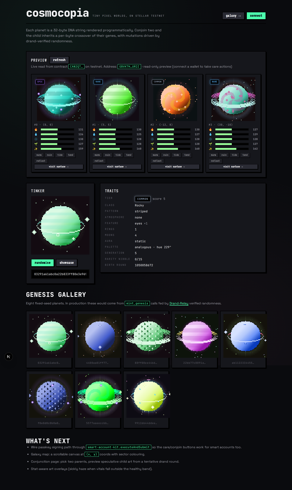
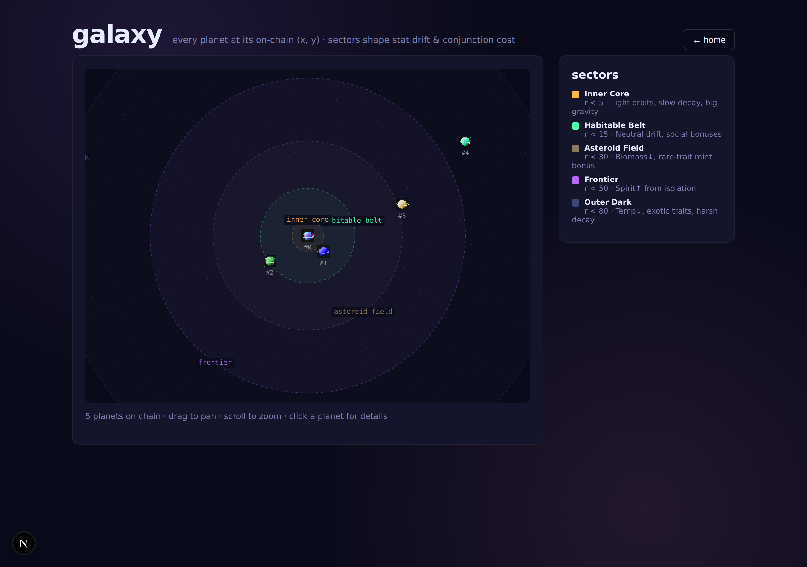

# Cosmocopia

> Tiny pixel-art worlds, on-chain on Stellar. Conjoin two planets — get a new one. Care for them or they wither.



*Live read from the testnet contract — the top "preview" row shows five planets owned by the deployer: tokens 0–3 are the genesis batch minted via Drand-Relay verified randomness, and #4 is the child born from conjoining tokens 0 and 1. Per-card vitals bars come from `vitals_of` on chain. Below that, the tinker panel renders any 32-byte DNA you paste, and the genesis gallery shows fixed-seed showcase planets that span the class space.*

Cosmocopia is an Axie-style collection-of-creatures project, but instead of monsters they are **planets**: each a 96×96 pixel art world programmatically rendered from on-chain DNA, born from drand-verified randomness on Stellar/Soroban.

The deliberate non-goal: no game / no PvP / no economy beyond mint + conjoin + care. The fun lives in the genetics, the art, and the galaxy map.

## The big ideas

### Planets
A planet is a Soroban NFT with two pieces of state:

- **DNA** — 32 immutable bytes, set at mint, drives every visual trait.
- **Vitals** — 5 mutable stats that decay over ledger time and respond to interactions.

### Conjunction (the breeding mechanic, renamed)
The astronomical term for "two bodies meeting in the sky" is a **conjunction**. We use it as our verb:

> *Conjoin* two planets, and at the next drand round a third planet is **conceived**.

Two parents → child whose DNA is a per-byte crossover of theirs, with a small mutation rate driven by drand randomness. Stats are averaged with noise. Cooldowns and a small XLM fee keep it interesting.

### Care
Planets are not idle. Each has five vitals (0–255):

| Vital | Decays from | Restored by |
| --- | --- | --- |
| Temperature | Cold sectors, ice/void classes | `warm` (sun ritual) |
| Hydration | Lava class, desert sectors | `rain` (cloud seeding) |
| Gravity | Long quiet stretches | `tide` (gravity pulse) |
| Biomass | Inactivity, void class | `tend` (gardening) |
| Spirit | Isolation in the galaxy | `reflect`, nearby neighbors |

Stats outside `[40, 220]` reduce conjunction success and add a "sickly" aura overlay to the rendered art. Care recipe differs by class — watering a Lava planet hurts it.

### Galaxy



*The `/galaxy` page is a live 2D map of every minted planet at its on-chain `(x, y)`. Concentric dashed rings mark the five sectors; the same `r²` thresholds drive [`stats::project`](contracts/planet/src/stats.rs) so a planet's location actually shapes its decay. Pan with drag, zoom with the wheel, click a planet for stats + DNA + owner.*

Each planet has `(x, y)` coordinates in an integer grid. The grid is partitioned into eight **sectors** that each apply stat drift modifiers:

- *Inner Core* — high gravity, slow decay
- *Habitable Belt* — neutral, social bonus
- *Asteroid Field* — biomass↓, rare-trait mint bonus
- *Frontier* — spirit↑ from isolation
- *Outer Dark* — temperature↓, exotic-trait bonus
- *Nebula* — hydration↑, palette saturation bonus
- *Singularity* — gravity↑↑, conjunction mutation rate↑
- *Edge* — wildcard drift, generation bonus

Distance between two planets sets the **conjunction cost** and, indirectly, the mutation rate. Two neighbors yield cheap, conservative children; opposites yield expensive, exotic ones.

## DNA layout (32 bytes)

```
0   class_gene    high nibble = class (16 classes) | low nibble = dominance map
1   surface_gene  high = pattern (striped/spotted/swirled/cracked/smooth/...) | low = rings (0-15)
2   atmosphere_gene  none/thin/thick/storm/aurora/toxic/sparkle/eclipse/halo + density
3   feature_gene  craters/oceans/mountains/forests/cities/eyes/volcanoes/runes/blossoms
4   moon_gene     count (0-4) + style + tilt
5   aura_gene     none/halo/glow/shadow/pulse/aurora/static + intensity
6   palette_hue   base hue (0-255 ≈ 0-360°)
7   palette_meta  scheme (mono/analogous/complementary/triadic/split) + sat + lum
8-11 parent_mix   parent DNA XOR-mixed (lineage signature)
12-15 birth_round drand round at mint (u32 BE) — also reproducible seed
16   generation   0 for genesis, parent_max + 1 otherwise
17   affinity_rarity  affinity (solar/lunar/void/storm) | rarity bits
18-31 reserved    14 bytes of headroom for future traits & uniqueness salt
```

16 classes: `Rocky, Gas, Ocean, Lava, Ice, Desert, Jungle, Crystal, Void, Forge, Bloom, Cinder, Mist, Quartz, Hollow, Aether`.

## Architecture

```
cosmocopia/
├── contracts/                  # Soroban Rust workspace
│   ├── Cargo.toml              # workspace + pinned OpenZeppelin stellar-* crates
│   └── planet/                 # One contract — all the logic
│       ├── Cargo.toml
│       └── src/
│           ├── lib.rs          # NonFungibleToken impl + entrypoints
│           ├── dna.rs          # DNA encoding/decoding + crossover
│           ├── stats.rs        # vitals + decay + care
│           ├── galaxy.rs       # coords + sector lookup + distance
│           └── drand.rs        # cross-contract client for Drand-Relay verifier
├── art/                        # Deterministic pixel-art renderer (pure TS)
│   └── src/
│       ├── dna.ts              # 32-byte parser matching contract layout
│       ├── palette.ts          # HSL palette schemes
│       ├── layers/             # core, surface, atmosphere, rings, features, moons, aura
│       └── render.ts           # Compose layers → ImageData / PNG
├── web/                        # Next.js dApp
│   └── src/
│       ├── app/                # galaxy / planet / conjunction pages
│       ├── lib/stellar.ts      # Wallets Kit + contract bindings
│       └── components/Planet.tsx
├── scripts/
│   ├── deploy.sh               # build + deploy contract to testnet
│   └── mint-genesis.sh         # admin batch-mint of seed planets
└── README.md
```

## External dependencies

- **Drand-Relay** ([kaankacar/Drand-Relay](https://github.com/kaankacar/Drand-Relay)) — testnet verifier `CAESC7SC5EW5P2P3IM5Q7E64ZNDATVSN5F57NTCH5E7GJRPDM76KF7QM`. We call `latest()` for mints and conjunctions; commit-reveal scheduled for v2.
- **OpenZeppelin stellar-contracts** ([repo](https://github.com/OpenZeppelin/stellar-contracts)) — `stellar-tokens::non_fungible` for the NFT base, `stellar-access::ownable` for admin gating, `stellar-macros` for `#[only_owner]`.
- **OpenZeppelin Contracts Wizard** — used to seed the initial NFT shell (Stellar tab on wizard.openzeppelin.com or the `@openzeppelin/wizard-stellar` npm package).
- **Smart Account Kit** ([kalepail/smart-account-kit](https://github.com/kalepail/smart-account-kit), published on npm as `smart-account-kit`) — passkey-based smart wallets. Testnet WASM hash `8537b8166c0078440a5324c12f6db48d6340d157c306a54c5ea81405abcc2611`, WebAuthn verifier `CCMR63YE5T7MPWREF3PC5XNTTGXFSB4GYUGUIT5POHP2UGCS65TBIUUU`.
- **Stellar Wallets Kit** ([Creit-Tech/Stellar-Wallets-Kit](https://github.com/Creit-Tech/Stellar-Wallets-Kit), JSR package `@creit-tech/stellar-wallets-kit`) — modal adapter for Freighter, xBull, Albedo, Lobstr, Rabet, Hana, etc.

## Sign-in

The frontend offers both paths side-by-side. Users pick at connect time:

- **Continue with a passkey** — Smart Account Kit deploys a smart-account contract on testnet, gas-sponsored, signed via WebAuthn. No extension needed; works on iOS/macOS/Android/Windows Hello. Returns a `C...` contract address as the signing identity.
- **Connect an existing wallet** — Stellar Wallets Kit's auth modal lists installed wallets. Returns a `G...` public key as the signing identity.

Either identity is passed to the planet contract as the `to:` / owner address. Configure via `web/.env.local`.

### Trying the passkey flow end-to-end

For a passkey-owned smart account to actually *do* anything on chain, it needs to own a planet first (the contract's `care`/`conjoin` calls require the planet's owner to authorize). The seeded planets all start owned by the deployer. To hand one over:

```bash
# 1. Connect with a passkey at http://localhost:3030 → note the C... contract address
# 2. Transfer one of the genesis planets to that address:
bash scripts/transfer-planet.sh 1 CXXXXXXX...
# 3. Refresh the page → your gallery now includes that planet → click a care button.
```

The care button triggers a WebAuthn prompt; on confirmation, Smart Account Kit signs the auth entry, re-simulates, and submits.

## Roadmap

- [x] Repo scaffold + design
- [ ] Soroban workspace + planet contract MVP
- [ ] Unit tests (DNA crossover determinism, stat decay, sector modifiers)
- [ ] Pixel-art TS renderer with snapshot tests
- [ ] Next.js frontend (Galaxy view, Planet detail, Conjunction)
- [ ] Testnet deploy script + genesis mint
- [ ] Commit-reveal mint for fairness (v2)
- [ ] Stat-aware art overlays (sickly / blooming) (v2)
